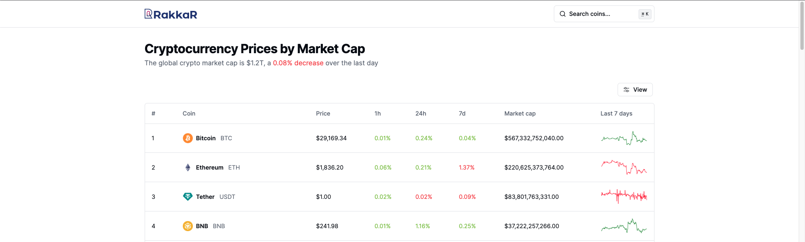

# Cryptocurrency Viewer Website

Welcome to the Cryptocurrency Viewer Website repository! This project aims to provide a platform to view information about various cryptocurrencies. You can explore coin details, market trends, and more.

**Live Demo: [Coin Market](https://coin-market-mauve.vercel.app)**

[](https://coin-market-mauve.vercel.app)


## Technologies Used

This project utilizes a variety of technologies to deliver a seamless user experience. Some of the key technologies and tools used in this project include:

- **Framework:** [Next.js](https://nextjs.org)
- **Styling:** [Tailwind CSS](https://tailwindcss.com)
- **UI Components:** [shadcn/ui](https://ui.shadcn.com)

## Data Source

This project fetches cryptocurrency data from the CoinGecko API. For detailed information on how to use the API, refer to the [CoinGecko API Documentation](https://www.coingecko.com/en/api/documentation).

## Features to be implemented

- [x] **Coin List:** View a list of cryptocurrencies with pagination.
- [x] **Coin Details:** Get detailed information about a specific cryptocurrency.
- [x] **Coin Searching:** Explore coin including trending coins, categories.
- [x] **Chart Viewing:** Explore coin price chart (line chart / ohlc chart).
- [ ] **Coin favorite:** Add favorite & another page for display favored coins.

## Running Locally

1. Install dependencies using pnpm

```bash
pnpm install
```

2. Copy the `.env.example` to `.env` and update the variables.

```bash
cp .env.example .env
```

3. Start the development server

```bash
pnpm run dev
```

## License

Licensed under the MIT License. Check the [LICENSE](./LICENSE) file for details.